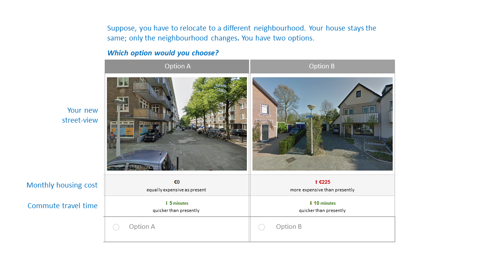

# Computer vision-enriched discrete choice models
This repo contains the data that are used to train the computer vision-enriched discrete choice models (CV-DCM) proposed this [Van Cranenburgh & Garrido-Valenzuela (2025)](https://doi.org/10.1016/j.tra.2024.104300). A preprint is available in [here](assets/VanCranenburgh_GarridoValenzuela2024.pdf).

## Data

The data file [data_CV_DCM.csv](data/data_CV_DCM.csv) contains data from a stated choice experiment. In the experiment, respondents were presented two residential location alternatives, and were asked to indicate which alternative they would choose. Both alternatives comprise travel time (TT), monthly housing cost (C) and an image showing the street-level conditions. Here, you see a screenshot of a choice task from the stated choice experiment.

 

The table below lists the most important variables in the data set:

| Variable | Description |
| --- | --- |
| `CHOICE` | 1 if the respondent chose alternative 1, 2 if the respondent chose alternative 2 |
| `Ci` | Monthly housing cost of alternative i |
| `TTi` | Travel time to alternative i |
| `IMGi` | Image ID used of alternative i |
| `IMG_LATi` | Latitude of the location of the image of alternative i |
| `IMG_LNGi` | Longitude of the location of the image of alternative i |
| `ANGLE_FROM_NORTH_IMGi`| Angle from the north in degrees used to take the image of alternative i |
| `AGE` | Age of the respondent |
| `GENDER` | Gender of the respondent |
| `PROVINCE` | Province of the respondent |
| `POSTCODE` | Postcode of the respondent |
| `train` | 1 if the respondent was in the training set |
| `test` | 1 if the respondent was in the test set |

More details about the data collection can be found in section 3 of the associated paper:
[Van Cranenburgh & Garrido-Valenzuela (2025)](https://doi.org/10.1016/j.tra.2024.104300).

## Discrete choice models
In the folder [CVDCM](CVDCM), python code is made available to train and evaluate the CV-DCM models. In the folder [DCM](DCM), you can find the implementation of the traditional discrete choice models. Note that Appolo R is used for the estimation of the choice models, within a jupyter notebook.

## License CC BY-NC-SA 4.0

Shield: [![CC BY-NC-SA 4.0][cc-by-nc-sa-shield]][cc-by-nc-sa]

This work is licensed under a
[Creative Commons Attribution-NonCommercial-ShareAlike 4.0 International License][cc-by-nc-sa].

[![CC BY-NC-SA 4.0][cc-by-nc-sa-image]][cc-by-nc-sa]

[cc-by-nc-sa]: http://creativecommons.org/licenses/by-nc-sa/4.0/
[cc-by-nc-sa-image]: https://licensebuttons.net/l/by-nc-sa/4.0/88x31.png
[cc-by-nc-sa-shield]: https://img.shields.io/badge/License-CC%20BY--NC--SA%204.0-lightgrey.svg
