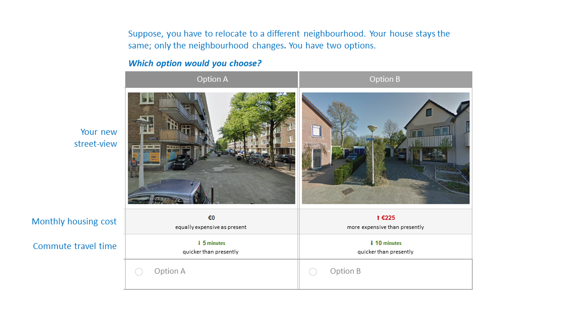

# Computer-vision-enriched-DCMs
Code and data to train computer vision enriched discrete choice models in PyTorch

The file "data_CV_DCM.csv" contain data from a stated choice experiment. In the experiment, respondents were presented two residential location alternatives, and were asked to indicate which alternative they would choose. Both alternative comprise travel time, monthly housing cost and an image showing the street-level conditions.

 
