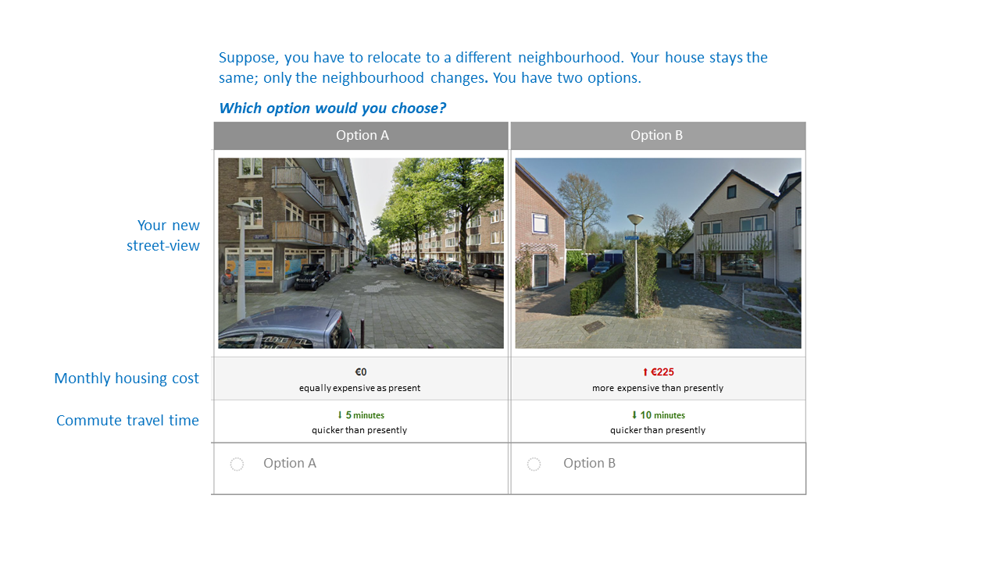

# Computer vision-enriched discrete choice models
This repo contains models and data to train the computer vision-enriched discrete choice models (CV-DCM) proposed in [Van Cranenburgh & Garrido-Valenzuela (2025)](https://doi.org/10.1016/j.tra.2024.104300). A preprint of the paper is available [here](assets/VanCranenburgh_GarridoValenzuela2024.pdf).

## Data

The data file [data_CV_DCM.csv](data/data_CV_DCM.csv) contains data from a stated choice experiment. In the experiment, respondents were presented two residential location alternatives, and were asked to indicate which alternative they would choose. Both alternatives comprise travel time (TT), monthly housing cost (C) and an image showing the street-level conditions. Here, you see a screenshot of a choice task from the stated choice experiment.

 

The table below lists the most important variables in the data set:

### Stated choice data
| Variable | Description | Coding / values |
| --- | --- | --- |
| `ID` | Unique identifier of the observation | int |
| `RID` | Unique identifier of the respondent | int |
| `CHOICE` | Chosen alternative | 1 = alternative 1 2 = alternative 2 |
| `N_TASKS` | Number of choice tasks completed by the respondent | int |
| `train` | Indicator for belonging to the training set | 1 = yes |
| `test` | Indicator for belonging to the test set | 1 = yes |
| `Ci` | Monthly housing cost of alternative *i* | int |
| `TTi` | Travel time to alternative *i* | int |
| `IMGi` | Image file name used for alternative *i* | str |
| `IMG_YEARi` | Year the image of alternative *i* was taken | int |
| `IMG_MONTHi` | Month the image of alternative *i* was taken | int |
| `IMG_LATi` | Latitude of the location of the image of alternative *i* | float |
| `IMG_LNGi` | Longitude of the location of the image of alternative *i* | float |
| `ANGLE_FROM_NORTH_IMGi` | Angle from north, in degrees, used to take the image of alternative *i* | float |

### Socio-demographic and background variables
| Variable | Description | Coding / values |
| --- | --- | --- |
| `AGE` | Age of the respondent | 1 = Younger than 18 years 2 = 18–29 years 3 = 30–39 years 4 = 40–49 years 5 = 50–59 years 6 = 60–69 years 7 = 70 years or older |
| `GENDER` | Gender of the respondent | 1 = Man 2 = Woman 3 = Other / Prefer not to answer |
| `MODE` | Primary transport mode used to commute to work or study place | 1 = Bicycle, e-bike, scooter, brommer 2 = Bus, metro, tram 3 = Train 4 = Car, motorcycle 5 = None of the above |
| `TT_CAT` | Travel time for a single trip to work or study place | 1 = Less than 10 minutes 2 = 10–20 minutes 3 = 20–30 minutes 4 = 30–45 minutes 5 = More than 45 minutes 6 = None of the above |
| `TR_DAYS` | Number of days per week travelled to work or study place | 1 = None 2 = 1 time per week 3 = 2 times per week 4 = 3 times per week 5 = 4 times per week 6 = 5 times per week or more |
| `IMP_IMG` | Self-reported importance of the image in the respondent’s decisions     | 1–10 Likert scale |
| `IMP_HHC` | Self-reported importance of housing cost in the respondent’s decisions  | 1–10 Likert scale |
| `IMP_TTI`  | Self-reported importance of travel time in the respondent’s decisions   | 1–10 Likert scale |
| `NGBH_SC` | Self-reported visual attractiveness of the current neighbourhood | 1–5 Likert scale |
| `HOUSE_TYPE` | Current type of housing | 1 = Multiple-family dwelling 2 = Terraced house 3 = Corner house 4 = Semi-detached house 5 = Detached house |
| `HH_COMP` | Household composition | 1 = Single-person household 2 = Multi-person household without children 3 = Multi-person household with children |
| `REGION` | Region based on province | 'North' (Groningen, Friesland, Drenthe) 'East' (Overijssel, Flevoland, Gelderland) 'South' (Noord-Brabant, Limburg) 'West' (Utrecht, Noord-Holland, Zuid-Holland, Zeeland) |

More details about the data collection can be found in section 3 of the associated paper:
[Van Cranenburgh & Garrido-Valenzuela (2025)](https://doi.org/10.1016/j.tra.2024.104300).

## Discrete choice models
In the folder [CVDCM](CVDCM), python code is made available to train and evaluate the CV-DCM models. It contain code to train a simple CV-DCM model, without interaction terms and dummies for the month of the year. In the folder [DCM](DCM), you can find the implementation of the traditional discrete choice models. Note that Apollo R is used for the estimation of the traditional choice models, within a jupyter notebook.

## License CC BY-NC-SA 4.0

Shield: [![CC BY-NC-SA 4.0][cc-by-nc-sa-shield]][cc-by-nc-sa]

This work is licensed under a
[Creative Commons Attribution-NonCommercial-ShareAlike 4.0 International License][cc-by-nc-sa].

[![CC BY-NC-SA 4.0][cc-by-nc-sa-image]][cc-by-nc-sa]

[cc-by-nc-sa]: http://creativecommons.org/licenses/by-nc-sa/4.0/
[cc-by-nc-sa-image]: https://licensebuttons.net/l/by-nc-sa/4.0/88x31.png
[cc-by-nc-sa-shield]: https://img.shields.io/badge/License-CC%20BY--NC--SA%204.0-lightgrey.svg
